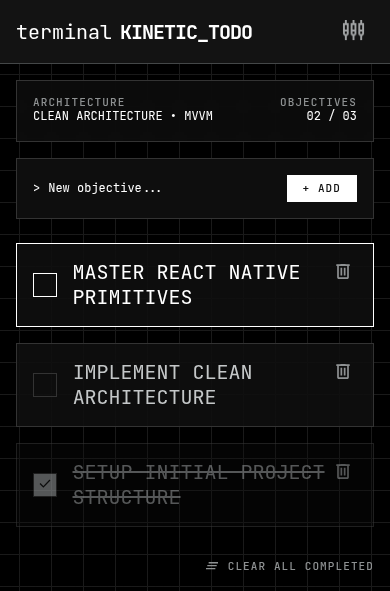

# ⬡ KINETIC TODO

> **Cybernetic Objective Engine for Android**

<p align="center">
  
</p>

<p align="center">
  
  
  
  
  
</p>

---

## 🖥️ User Interface

High-contrast dark terminal interface with monospace typography, matrix grid background, instant synchronous MMKV persistence, and zero bloat.

<p align="center">
  
</p>

### Features

- **Header Telemetry**: Real-time ratio tracking (`COMPLETED / TOTAL` objectives).
- **Command Prompt Input**: Terminal prompt `> New objective...` with rapid `+ ADD` dispatch.
- **Objective Cards**: Focus outlines, instant toggle, completion strikethrough, and single-tap deletion.
- **Batch Processing**: Single-touch `CLEAR ALL COMPLETED` action pipeline.
- **Fast Synchronous Persistence**: Powered by Tencent MMKV v4 via C++ JSI / NitroModules.

---

## 🏗️ Architecture

```text
UI (TasksScreen)
       ↓
Zustand Store (useTaskStore)
       ↓
Task Repository (TaskRepository)
       ↓
MMKV Storage (createMMKV)
```

### Project Structure

```text
src/
├── app/                         # 🧭 Expo Router Navigation
│   ├── _layout.tsx              # Root Layout (SafeArea, ErrorBoundary, Grid, Header)
│   └── index.tsx                # Home Route (TasksScreen)
│
├── features/
│   └── tasks/                   # 📦 Feature-Driven Task Engine
│       ├── components/          # TaskInput, TaskItem, TaskHeaderStats
│       ├── models/              # tasks.types.ts
│       ├── repositories/        # task.repository.ts (MMKV Data Access)
│       ├── store/               # taskStore.ts, taskStore.types.ts (Zustand State)
│       └── tasks_screen.tsx     # Main View Component
│
└── core/                        # ⚙️ Shared Infrastructure
    ├── components/              # AppHeader, GridBackground
    ├── config/                  # Zod validation & immutable frozen config
    ├── errors/                  # ErrorBoundary & withErrorCatch handler
    ├── storage/                 # MMKV storage instance
    └── theme/                   # Terminal color palette, spacing, typography
```

---

## 🚀 Development & Local Builds

### 1. Install Dependencies

```bash
bun install
```

### 2. Start Development Server

```bash
bun start
```

### 3. Run on Device / Emulator

```bash
# Compile and run debug APK
bun run android

# Release build
bun run android:release
```

### 4. Build Standalone Release APK Locally

```bash
bun run build:apk
```

---

## 🛠️ Tech Stack

- **Runtime**: [React Native 0.81.5](https://reactnative.dev/) (Hermes + New Architecture / Fabric)
- **Framework**: [Expo SDK 54](https://docs.expo.dev/) & [Expo Router 6](https://docs.expo.dev/router/introduction/)
- **Storage**: [react-native-mmkv 4.3.2](https://github.com/mrousavy/react-native-mmkv) (C++ NitroModules)
- **State Management**: [Zustand 5](https://zustand-demo.pmnd.rs/)
- **Validation**: [Zod 4](https://zod.dev/)
- **Crypto**: `expo-crypto`

---

<p align="center">
  <sub>Built with Clean Architecture & Modular Monolith Principles.</sub>
</p>
