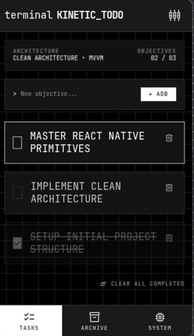

# ⬡ KINETIC TODO
> **Cybernetic Objective Engine & Modular Telemetry Task Suite for Android & iOS**

<p align="center">
  
</p>

<p align="center">
  <a href="https://github.com/addynoven/KINETIC-TODO/releases/latest">
    
  </a>
  <a href="https://github.com/addynoven/KINETIC-TODO/releases">
    
  </a>
  
  
</p>

---

## 📥 Direct APK Downloads

Get the latest optimized build directly for your Android device:

| Package | Size | Target | Direct Download |
| :--- | :--- | :--- | :--- |
| **`app-arm64-v8a-release.apk`** *(Recommended)* | **~11 MB** | Modern Android Phones (64-bit ARM) | [⬇️ Download ARM64 APK](https://github.com/addynoven/KINETIC-TODO/releases/latest/download/app-arm64-v8a-release.apk) |
| **`app-universal-release.apk`** | **~24 MB** | All Android Devices & Emulators | [⬇️ Download Universal APK](https://github.com/addynoven/KINETIC-TODO/releases/latest/download/app-universal-release.apk) |
| **All Releases & Assets** | — | Release Changelogs & Previous Versions | [📦 View All Releases](https://github.com/addynoven/KINETIC-TODO/releases) |

---

## 🖥️ User Interface & Aesthetic

Built with a high-contrast dark terminal interface, monospace typography, segmented telemetry gauges, and a matrix background grid.

<p align="center">
  
  
  
</p>

### 1. `TASKS` — Objective Execution Hub
- **Architecture Overview**: Dynamic header monitoring task completion metrics in real time.
- **Terminal Input**: Command prompt style (`> New objective...`) with rapid `+ ADD` dispatch.
- **Objective Cards**: High-contrast active focus outlines, completion strikethrough, and single-tap purge.
- **Batch Processing**: Single-touch `CLEAR ALL COMPLETED` action pipeline.

### 2. `ARCHIVE` — Vaulted Data Store
- **Query Engine**: Real-time filtering by task title or hex node address.
- **Hex ID & Delta Timestamps**: Granular provenance tracing (e.g. `0x8F2A1`, `T-04:12:00`).
- **Classification Badges**: Differentiates between standard `ARCHIVED` and high-priority `VAULTED` records.
- **Historical Node Loading**: Expandable data streams for deep historical audits.

### 3. `SYSTEM` — Real-Time Diagnostic Dashboard
- **Kernel Status Banner**: Uptime tracking and semantic build versioning.
- **Task Density Monitor**: 10-stage segmented progress meter with 24-hour delta tracking.
- **Memory Allocation**: Real-time memory footprint visualization against system ceiling limits.
- **Sync Latency Histogram**: Multi-bar telemetry chart measuring roundtrip packet latency.
- **Structured System Logs**: Color-coded diagnostic event log (`INFO`, `ACTION`, `WARN`, `CRON`) with log export.

---

## 🏗️ Architecture & Philosophy

```
src/
├── core/                        # Global foundational systems
│   ├── components/              # GridBackground, AppHeader, BottomNav
│   ├── errors/                  # ErrorBoundary, structured error pipeline
│   └── theme/                   # Terminal color palette, spacing, typography
│
└── features/                    # Feature-Driven Modular Architecture
    ├── tasks/                   # Objective Management Feature
    │   ├── components/          # TaskInput, TaskItem, TaskHeaderStats
    │   ├── hooks/               # useTask, task_action_pipeline
    │   ├── models/              # tasks.types.ts
    │   ├── repositories/        # task.repository.ts
    │   ├── services/            # task.service.ts
    │   ├── validation/          # task.validator.ts
    │   └── tasks_screen.tsx
    │
    ├── archive/                 # Data Vault & Query Feature
    │   ├── components/          # ArchiveSearch, ArchiveItem
    │   ├── models/              # archive.types.ts
    │   ├── services/            # archive.service.ts
    │   └── archive_screen.tsx
    │
    └── system/                  # Telemetry & Diagnostics Feature
        ├── components/          # MetricCard, SegmentedBar, LatencyHistogram, SystemLogs
        ├── models/              # system.types.ts
        └── system_screen.tsx
```

---

## 🚀 Quick Start & Development

### 1. Install Dependencies
```bash
bun install
# or: npm install
```

### 2. Start Development Server
```bash
bun start
# or: npx expo start
```

### 3. Run on Device
```bash
# Debug mode (hot reloading)
bun run android

# Release mode (standalone)
bun run android:release
```

### 4. Build Optimized Android APK Locally
```bash
bun run build:apk
```
Output: `android/app/build/outputs/apk/release/app-arm64-v8a-release.apk` (~11 MB)

---

## 🏷️ Publishing a GitHub Release (Automated CI/CD)

Whenever you want to publish a new release with APK attachments and update the download counter:

```bash
# 1. Commit and push your changes
git add .
git commit -m "feat: release v1.0.0"
git push origin main

# 2. Create and push a version tag
git tag v1.0.0
git push origin v1.0.0
```

GitHub Actions will automatically:
1. Trigger the release workflow in [`.github/workflows/release.yml`](.github/workflows/release.yml).
2. Prebuild and compile the optimized Android APKs.
3. Publish a new Release under **Releases** on GitHub with all APK assets attached for direct download.
4. Update the **Download Counter** badge automatically.

---

## 🛠️ Tech Stack

- **Runtime**: [React Native 0.81.5](https://reactnative.dev/) with Hermes JS Engine & New Architecture
- **Framework**: [Expo SDK 54](https://docs.expo.dev/)
- **Icons**: `@expo/vector-icons` (Octicons, MaterialCommunityIcons)
- **Safe Area**: `react-native-safe-area-context`
- **Compiler**: TypeScript 5.9 (Strict Type Safety)

---

<p align="center">
  <sub>Engineered with Clean Architecture & Modular MVVM Principles.</sub>
</p>
